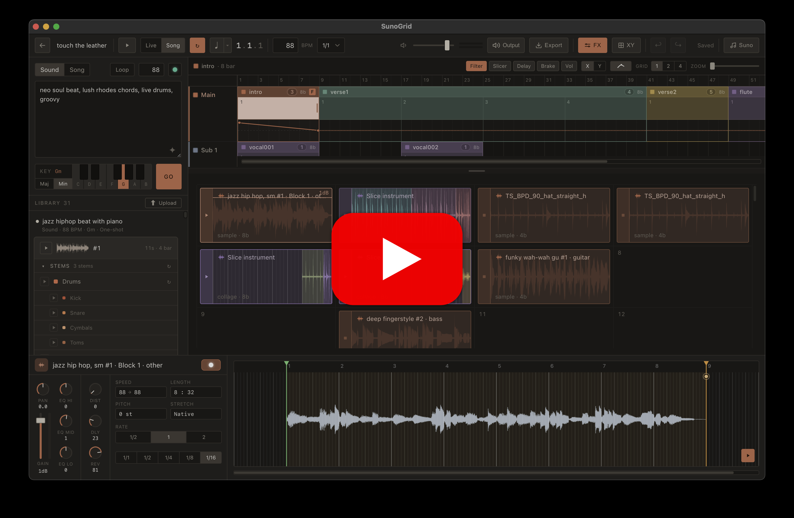

# SunoGrid

> Browser-based AI loop machine / groovebox (style-agnostic): generate loops in any style with Suno, auto-warp them to your project BPM, drag them onto a grid, and start/stop with **bar-level quantization** to build beats and arrangements.
>
> 浏览器里的 **AI loop 机 / groovebox(风格无关)**:用 Suno 生成任意风格的 loop,自动对齐到工程 BPM,拖进网格,**小节级量化**启停,做 beat 与编曲。

<p align="center">
  <a href="https://youtu.be/nbHNv4ZrUk0">
    
  </a>
  <br>
  <a href="https://youtu.be/nbHNv4ZrUk0"><b>▶ Watch the demo</b></a>
</p>

**[English](#english) · [中文](#中文)**

---

## English

**SunoGrid** combines "generate material with AI" and "perform / arrange like a groovebox" into a single browser app. You describe the sound you want → Suno generates a loop → it's auto-tempo-detected, snapped to whole bars, warped offline to your project BPM, and given clean loop points → you drag it onto the grid and it starts quantized to bar boundaries.

### Features

- **AI loop generation (any style)** — describe a sound and Suno generates a loop; works for any genre, with no style-specific logic in the engine.
- **Auto-conditioning + offline warp** — automatic BPM / loop-region detection, snap to whole bars, then time-stretch + pitch-shift offline (WASM) to the project's BPM and key. Playback runs a plain looping source, so it **never glitches**.
- **Bar-quantized playback** — start/stop align to bar boundaries; seamless looping with no real-time stretching.
- **Clip editor** — per-clip warp / trim / slice, a snap-to-grid start-offset marker, and tail fade-out.
- **Arrangement** — a free grid with snap / drag / drop and sub-bar placement; **Live** scene switching plus a **Song** multitrack arranger (a snap-to-grid main lane + freely-placed sub lanes anchored to it, like a video editor's linked clips), with looping and an XY automation lane.
- **Collage tool** — chop several samples into pieces, warp each piece independently, rearrange them into one bar-loop, and bake it onto a pad.
- **Pad-bank loop machine** — classic pad-grid triggering of ready loops.
- **Stem separation** — a self-hosted Demucs sidecar splits a loop into stems (drums / bass / vocals / …); drums can be split further into kick / snare / toms / cymbals. Stems inherit the parent warp and stay phase-locked.
- **Mixer + master FX** — per-instrument gain / pan / 3-band EQ and solo; a master send/return FX bus (distortion / delay / reverb).
- **XY performance pad** — a Kaoss-style master-insert with multiple programs (filter / slicer / delay / brake).
- **Local sample upload** — bring your own wav / mp3, auto-estimate BPM & key, and add it to your library.
- **Undo / redo** — snapshot-stack undo covering edits across the project.
- **Accounts & projects** — username/password auth, normalized persistence with optimistic sync, multi-tenant scoping, and shareable read-only **example projects** (fork-on-open: opening one clones an editable copy into your account).

### How it works

The core is a **generate → preprocess → ready → quantized playback** pipeline, and the key decision is to **never time-stretch during playback**:

```
prompt ──▶ Suno generates loop ──▶ conditioning (find loop region · snap to whole bars)
                                            │
                                            ▼
                              offline warp (to project BPM + pitch, WASM)
                                            │
                                            ▼
                        ready ──drag to grid──▶ quantized start/stop (bar-aligned)
```

- **Offline warp**: on drop / tempo change, `signalsmith-stretch` (WASM) renders — in one pass inside an `OfflineAudioContext` — a buffer that is already at project BPM, in the target key, and seamlessly loopable. The playback path only runs an ordinary looping source — no matter how slow, it just spins the grid, **never glitches**.
- **Conditioning**: Suno loops aren't whole-bar. The pipeline autocorrelates to find the real loop period, snaps it to the nearest integer number of bars, crops that region, then warps.
- **Bar-level quantization**: start/stop align to the next bar boundary. This is exactly what removes the hard real-time-latency constraint and turns the browser from "barely usable" into an ideal platform.

The organization model has evolved from a plain pad machine into **Project › Session › Instrument › Clip** (see `PRODUCT.md` §14): a project has multiple sessions (sections / playgrounds), each instrument holds several clips, and the **clip is the only processing unit in the sample domain** (warp / trim / slice).

### Repository layout

| Directory | Role |
|---|---|
| **`web/`** | **Main product.** Next.js + TS full-stack studio app (entry `/projects`). React client SPA core + Tone.js master clock + Web Audio / AudioWorklet + WASM warp; backend Route Handlers + Prisma / MySQL persistence; server-side proxy download of Suno mp3 (to bypass CORS). |
| **`suno-bridge/`** | **Suno bridge Chrome extension.** Suno has no public API; the extension bridges its private endpoints inside the page's live session (generate → poll feed → fetch cdn mp3), the token never leaves the browser, and a content script bridges directly into the app page. |
| **`stem-service/`** | **Self-hosted Demucs stem-separation sidecar** (FastAPI, `:8008`). Splits one loop into multiple stem sub-sounds that inherit the parent warp and stay phase-locked. |
| **`hhgen/`** | **v0 legacy (shelved).** Python (Demucs + librosa) that split full tracks into stems and sliced bars to build a local loop library — the approach from the old description. Now possibly reused only for "estimate BPM of imported external samples"; see `hhgen/README.md`. |
| **`PRODUCT.md`** | **Single source of truth**: full product shape, architecture decisions, the persistence / undo "constitutions", build order and progress. Read it before changing anything. |
| **`DEPLOY.md`** | Production deployment guide (services, MySQL, storage/CDN, reverse proxy, Suno plugin distribution, smoke checklist). |

### Tech stack

- **Frontend**: Next.js (App Router) · React (core `'use client'` SPA) · Tone.js · Web Audio / AudioWorklet · WASM (signalsmith-stretch) · Web MIDI
- **Backend**: Next.js Route Handlers (Node / TS) · Prisma 6 · MySQL · audio on disk (mock CDN)
- **Generation**: Suno (via the Chrome extension bridge)
- **Stem separation**: Demucs (Python FastAPI sidecar)

### Status

- ✅ Audio engine (quantized start/stop + seamless loops) · warp + conditioning + clip editor
- ✅ Pad-bank loop machine · **full Suno-driven pipeline** (prompt in the app → real Suno loop auto-conditioned + warped, grid-ready; E2E tested, any style)
- ✅ Free-grid arrange · collage tool (per-piece warp & rearrange) · stem separation · undo / redo · normalized persistence + optimistic sync + multi-tenant scoping
- ☐ Web MIDI (MPC hardware) and other later modules

### Run locally (short)

Needs a local **MySQL** (for `web/`). `ffmpeg` is only required by the optional Python sidecars (`stem-service/`, `hhgen/`), not by the web app.

```bash
# 1) web main app
cd web
npm install
cp .env.example .env          # fill in DATABASE_URL (local MySQL)
npx prisma db push            # create database / tables
npm run dev                   # open http://localhost:3007/projects (fixed to 3007 locally)

# 2) Suno bridge extension (required to generate loops)
#    chrome://extensions → enable Developer mode → load suno-bridge/, and log in to Suno

# 3) Stem-separation sidecar (optional)
cd stem-service && ./run.sh   # :8008
```

> Bridge setup details (token captured live, reload the extension + refresh both tabs after changes, etc.) are in `suno-bridge/README.md`. For production deployment, see `DEPLOY.md`.

### Notes

Reverse-engineering Suno's private endpoints for generation may violate its ToS; this is a known and accepted risk of the project. This repository is for **personal study and research only**.

### License

**Non-commercial. Personal research / study use only.** Licensed under the [PolyForm Noncommercial License 1.0.0](LICENSE) — you may use, modify, and share it for any noncommercial purpose (personal, research, education, etc.), but **commercial use is not permitted**. Note: a noncommercial restriction means this is *source-available*, not OSI "open source". See [`LICENSE`](LICENSE) for the full terms.

---

## 中文

**SunoGrid** 把"用 AI 生成素材"和"像 groovebox 一样演奏 / 编排"合进同一个浏览器 app。你描述想要的声音 → Suno 生成一段 loop → 自动测速、对齐整小节、离线变速到工程 BPM、钉好循环点 → 拖进网格,踩着小节边界量化启动。

### 功能

- **AI loop 生成(任意风格)** — 描述想要的声音,Suno 生成一段 loop;适用任何曲风,引擎里没有风格专属逻辑。
- **自动 conditioning + 离线 warp** — 自动测 BPM / 找循环区、snap 到整小节,再离线(WASM)变速 + 变调到工程的 BPM 与调。播放只跑普通循环 source,**绝不爆音**。
- **小节级量化播放** — 启停对齐小节边界;无缝循环,播放时不做实时变速。
- **Clip 编辑器** — 逐 clip warp / trim / slice、吸网格的起播刻度、尾部淡出。
- **编排** — 自由网格(吸附 / 拖移 / 拖放、允许 sub-bar);**Live** 场景切换 + **Song** 多轨 arranger(吸附主轨 + 锚定到主轨的自由 sub 轨,语义对标剪映 / Final Cut 的 linked clip),可循环 + XY 自动化 lane。
- **拼贴器** — 把多个样本切成碎片,逐片 warp,重排成一条整小节 loop,烘焙落到 pad。
- **Pad bank loop 机** — 经典 pad 网格触发就绪 loop。
- **乐器分离** — 自托管 Demucs sidecar 把 loop 拆成 stem(drums / bass / vocals / …);drums 还能再拆 kick / snare / toms / cymbals。子轨继承父 warp、天然锁相。
- **混音 + 主总线效果器** — 每件乐器 gain / pan / 三段 EQ + solo;主总线 send/return 效果器(失真 / 延迟 / 混响)。
- **XY 表演板** — Kaoss 式主总线 insert,多 program(滤波 / slicer / 延迟 / brake)。
- **本地样本上传** — 上传自己的 wav / mp3,自动估 BPM 与调,入库。
- **撤销 / 重做** — 快照栈式 undo,覆盖工程内各类编辑。
- **账户与项目** — 用户名/密码认证、规范化持久化 + 乐观同步、多租户 scoping,以及可共享的只读**示例项目**(进入即 fork:打开就在你账户里克隆出可编辑副本)。

### 它怎么工作

核心是一条 **生成 → 预处理 → 就绪 → 量化播放** 的流水线,关键决策是 **绝不在播放时实时变速**:

```
描述词 ──▶ Suno 生成 loop ──▶ conditioning(找循环区 · snap 到整小节)
                                       │
                                       ▼
                             离线 warp(变速到工程 BPM + 变调,WASM)
                                       │
                                       ▼
                       ready ──拖入网格──▶ 量化启停(对齐小节边界)
```

- **离线 warp**:落格 / 改速时用 `signalsmith-stretch`(WASM)在 `OfflineAudioContext` 一次性渲染出"已是工程 BPM、目标调、能无缝循环"的 buffer。播放路径只跑普通循环 source——再慢也只是格子转圈,**绝不爆音**。
- **conditioning**:Suno 的 loop 不是整小节。流水线先自相关找真实循环周期、snap 到最近整数小节,裁出区域再去 warp。
- **小节级量化**:启停都对齐到下一个小节边界。正是这一点去掉了实时延迟的硬约束,让浏览器从"勉强够用"变成理想平台。

组织模型已从单纯的 pad 机演进为 **Project › Session › Instrument › Clip**(详见 `PRODUCT.md` §14):工程下有多个 session(段落 / 操场),每个乐器挂若干 clip,**clip 是 sample 域唯一的处理单元**(warp / trim / slice)。

### 仓库结构

| 目录 | 作用 |
|---|---|
| **`web/`** | **主产品**。Next.js + TS 全栈 studio app(入口 `/projects`)。React 客户端 SPA 核心 + Tone.js 主时钟 + Web Audio / AudioWorklet + WASM warp;后端 Route Handlers + Prisma / MySQL 持久化;服务端代下载 Suno mp3(绕 CORS)。 |
| **`suno-bridge/`** | **Suno 桥接 Chrome 插件**。Suno 无公开 API,插件在页面活会话里桥接其私有接口(generate → feed 轮询 → 取 cdn mp3),token 不出浏览器,内容脚本桥接进 app 页面。 |
| **`stem-service/`** | **自托管 Demucs 乐器分离 sidecar**(FastAPI,`:8008`)。把一条 loop 拆成多条 stem 子 sound,继承父 warp 锁相。 |
| **`hhgen/`** | **v0 遗留(已搁置)**。Python(Demucs + librosa)把整曲拆分轨、切小节做本地 loop 库——就是旧描述里的方案。现仅可能在"导入外部样本估 BPM"时复用,详见 `hhgen/README.md`。 |
| **`PRODUCT.md`** | **唯一事实源**:完整产品形态、架构决策、持久化 / undo 宪法、开发顺序与进度。改任何功能前先读。 |
| **`DEPLOY.md`** | 生产部署指南(服务、MySQL、存储/CDN、反向代理、Suno 插件分发、冒烟检查)。 |

### 技术栈

- **前端**:Next.js(App Router)· React(核心 `'use client'` SPA)· Tone.js · Web Audio / AudioWorklet · WASM(signalsmith-stretch)· Web MIDI
- **后端**:Next.js Route Handlers(Node / TS)· Prisma 6 · MySQL · 磁盘存音频(模拟 CDN)
- **生成**:Suno(经 Chrome 插件桥接)
- **乐器分离**:Demucs(Python FastAPI sidecar)

### 进度

- ✅ 音频引擎(量化启停 + 无缝循环)· warp + conditioning + clip 编辑器
- ✅ pad bank loop 机 · **Suno 驱动全链路**(app 打词 → 真 Suno loop 自动 conditioning + warp 进格就绪,已 E2E 实测,任意风格)
- ✅ 自由网格 arrange · 拼贴器(逐片 warp 重排)· 乐器分离 · undo / redo · 规范化持久化 + 乐观同步 + 多租户 scoping
- ☐ Web MIDI(接 MPC 硬件)等后续模块

### 本地运行(简)

需要本机 **MySQL**(给 `web/` 用)。`ffmpeg` 只有可选的 Python sidecar(`stem-service/`、`hhgen/`)才需要,web app 不需要。

```bash
# 1) web 主 app
cd web
npm install
cp .env.example .env          # 填 DATABASE_URL(本机 MySQL)
npx prisma db push            # 建库 / 建表
npm run dev                   # 打开 http://localhost:3007/projects(本地固定 3007)

# 2) Suno 桥接插件(生成 loop 必需)
#    chrome://extensions → 开启开发者模式 → 加载 suno-bridge/,并登录 Suno

# 3) 乐器分离 sidecar(可选)
cd stem-service && ./run.sh   # :8008
```

> 联调细节(token 现取、改完要重载插件 + 刷两个标签等)见 `suno-bridge/README.md`。生产部署见 `DEPLOY.md`。

### 说明

逆向 Suno 私有接口用于生成可能违反其 ToS,这是本项目已知并接受的风险。本仓库**仅供个人学习与研究**。

### 许可

**不可商用,仅供个人研究 / 学习**。采用 [PolyForm Noncommercial License 1.0.0](LICENSE):你可以为任何非商业目的(个人、研究、教育等)使用、修改、分发本项目,但**禁止商业用途**。注:带非商用限制严格讲属于 *source-available*(源码可得),不算 OSI 定义的"开源"。完整条款见 [`LICENSE`](LICENSE)。
